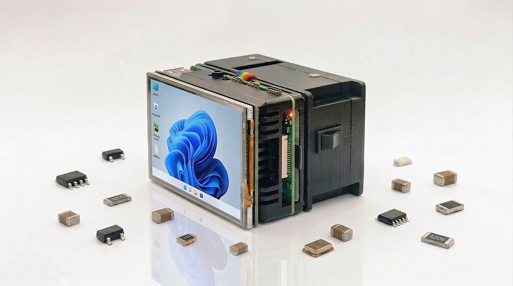
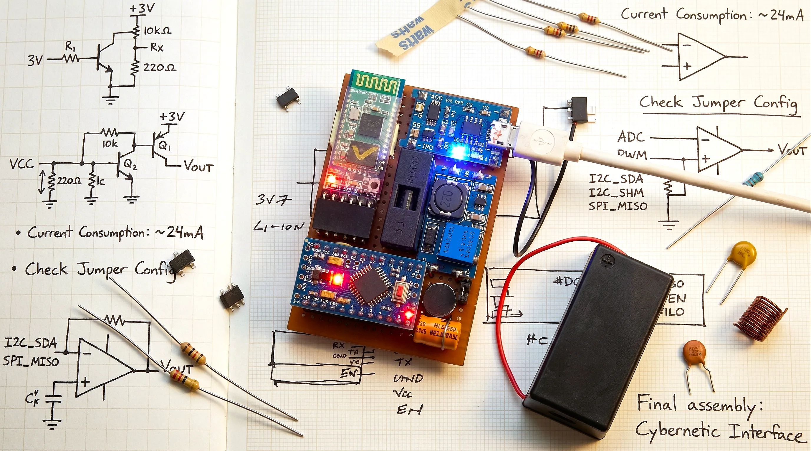
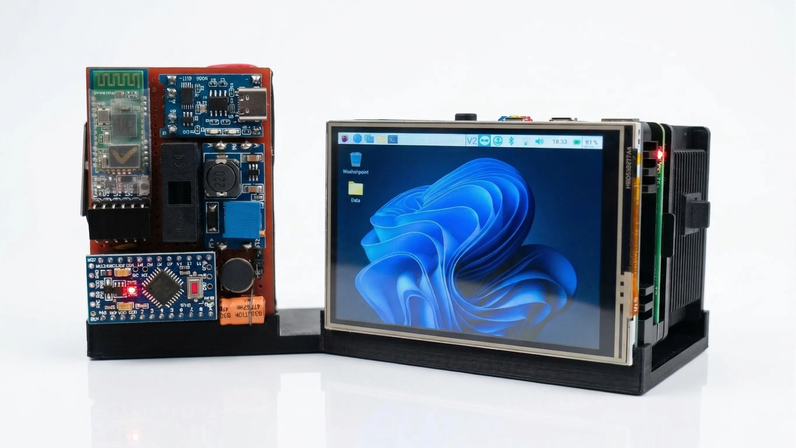
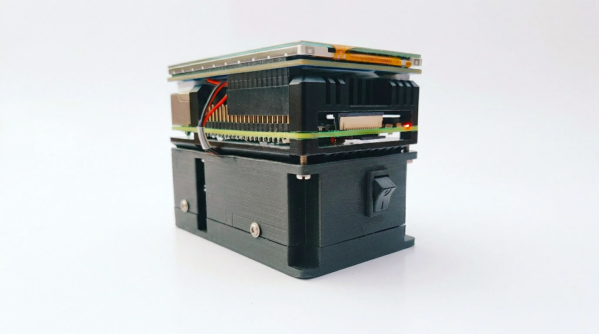

# OneDialect: A Unified Assistive Communication System

    

## Overview

**OneDialect** is an advanced assistive communication system engineered to empower individuals with **auditory, vocal, and visual impairments**. By seamlessly bridging the gap between speech, text, and tactile signals, the system establishes a reliable bidirectional interaction loop. 

Designed to eliminate the fragmentation in traditional assistive technology, OneDialect enables users with diverse sensory needs to communicate independently through a unified, high-performance embedded and software platform.

[Explore full details of the Unified Assistive Communication System](https://anandps.in/projects/unified-assistive-communication-system)

---

## Key Features

- **Bidirectional Translation**: Real-time conversion across Speech, Text, and Tactile (Morse) channels.
- **Low-Latency Interaction**: Deterministic control via a dedicated interaction layer.
- **Wireless Connectivity**: Seamless data transfer between master and slave units via Bluetooth.
- **Haptic Feedback**: High-precision vibration sequences for tactile communication.
- **Robust Embedded Logic**: State-based firmware with hardware-level circuit protections.

---

## Problem Space

Communication systems for differently-abled users are often fragmented, addressing isolated impairments. This creates a dependency on external assistance or requires learning specialized methods. **OneDialect** eliminates this fragmentation by enabling seamless translation across speech, text, and tactile communication channels within a single, unified device.

---

## System Architecture

The system utilizes a **dual-layer architecture** to ensure reliability and performance:

### 1. Processing Layer (High-Level)
*   **Speech Acquisition**: Captures and processes vocal input.
*   **Transcription**: Converts speech-to-text and text-to-speech.
*   **Encoding**: Handles text-to-Morse and Morse-to-text logic.
*   **Platform**: Raspberry Pi 4 Model B.

### 2. Interaction Layer (Real-Time)
*   **Signal Processing**: Real-time capture of physical inputs.
*   **Actuation**: Precise control of haptic motors and audio feedback.
*   **Interface**: Interrupt-driven Morse input decoding.
*   **Platform**: ATmega328P Microcontroller.

---

## Hardware Integration

| Component | Function |
| :--- | :--- |
| **ATmega328P** | Real-time interaction and signal processing |
| **Raspberry Pi 4** | High-level speech and text computation |
| **Z-Axis Haptic Motor** | Tactile feedback (Linear Resonant Actuator) |
| **HC-05 Bluetooth** | Wireless communication between layers |
| **Active Buzzer** | Audio status and feedback |
| **SPDT Switch** | Physical Morse input interface |
| **Li-ion Battery** | Optimized power with built-in protection circuitry |

---

## Development & Prototyping

---

## Tech Stack

- **Embedded**: C++ (Arduino IDE/AVR)
- **High-Level**: Python (Speech Recognition, TTS)
- **Design**: Fusion 360 (Mechanical Integration)
- **Protocols**: UART, PWM, Bluetooth (RF)
- **Processing**: Digital Signal Processing (DSP)

---

## Operational Flow

1.  **Input Phase**: User provides speech or physical Morse input.
2.  **Processing**: The Raspberry Pi handles transcription/synthesis while the ATmega328P manages real-time signals.
3.  **Communication**: Units exchange data wirelessly via Bluetooth.
4.  **Feedback**: The handheld unit renders messages as tactile vibration sequences or audio cues.

---

## System Visuals

| Master & Slave Integration | Master Unit (Internal) |
| :---: | :---: |
|  |  |

---

## Validation & Outcomes

The prototype was successfully tested under real-world usage conditions, demonstrating:
- **Accuracy**: High precision in Morse encoding and decoding.
- **Stability**: Consistent wireless data transfer over sustained periods.
- **Usability**: Accessible tactile feedback for users with visual or auditory impairments.

---

## Cost Engineering

The complete system is designed to be affordable and reliable, with a total build cost of approximately **₹16,700**. The Raspberry Pi 4 Model B represents the primary cost component, while other elements are optimized for value and durability.

---

## Future Scope

- Integration into **wearable form factors**.
- Support for **multi-language** processing.
- Implementation of **IoT-based emergency alert systems**.
- Expansion into a broader **assistive ecosystem**.

---

## Project Contributors
The system was designed and implemented by a cross-functional engineering team:

- **Ameer T S**
    - **Designation**: Power Electronics Developer
    - **Bio**: Electrical Engineer with hands-on experience in industrial and high-voltage systems. Skilled in PLC/SCADA, protective relays, transformers, and switchgear, with a strong focus on system reliability, preventive maintenance, and efficient operations.
    - **Links**: [LinkedIn](https://www.linkedin.com/in/ameerts) | [GitHub](https://github.com/ameeribnushajahan)

- **Anagha S**
    - **Designation**: Software Developer
    - **Bio**: Software developer with a strong focus on machine learning and video analytics. Combines analytical thinking with an artistic approach to build efficient and impactful solutions. Focused on clean architecture, problem-solving, and continuous technical growth.
    - **Links**: [LinkedIn](https://www.linkedin.com/in/anagha-s-menon-here) | [GitHub](https://github.com/ANAGHA-20)

- **Muhammed Sahal M H**
    - **Designation**: Hardware Developer
    - **Bio**: Electrical Engineer with maintenance experience across the manufacturing industry, along with experience in control panel assembly, diagnostics, and substation operations. Proven ability to resolve faults, and ensure reliable electrical system performance.
    - **Links**: [LinkedIn](https://www.linkedin.com/in/muhammed-sahal-m-h-391256194) | [GitHub](https://github.com/muhammed-sahal-m-h)

- **Ananya Ajith Kallungal**
    - **Designation**: ML Developer
    - **Bio**: Engineer skilled in machine learning, Python, and data-driven systems, with a background in electrical engineering. Focused on building scalable, efficient solutions while applying analytical models and system-level thinking to solve complex problems.
    - **Links**: [LinkedIn](https://www.linkedin.com/in/ananya-ajith-kallungal) | [GitHub](https://github.com/ananya-ajith-kallungal)

- **Anand P S**
    - **Designation**: Firmware Systems Developer
    - **Bio**: Engineer specializing in distributed backend architectures, embedded systems, firmware development, and production-grade software design. Builds efficient, fault-tolerant systems with a focus on scalability and long-term maintainability.
    - **Links**: [LinkedIn](https://www.linkedin.com/in/anand-ps) | [GitHub](https://github.com/anand-ps)

- **Sidharth S**
    - **Designation**: Software Developer
    - **Bio**: Software developer specializing in distributed systems and scalable backend architecture. Experienced in building high-performance applications using React, TypeScript, Node.js, and Go, with expertise in databases like Aerospike and ArangoDB. Focused on performance optimization, system reliability, and designing robust, production-grade solutions.
    - **Links**: [LinkedIn](https://www.linkedin.com/in/sidharthism/) | [GitHub](https://github.com/sidharthism)

---
© 2026 Anand P S. All rights reserved.
