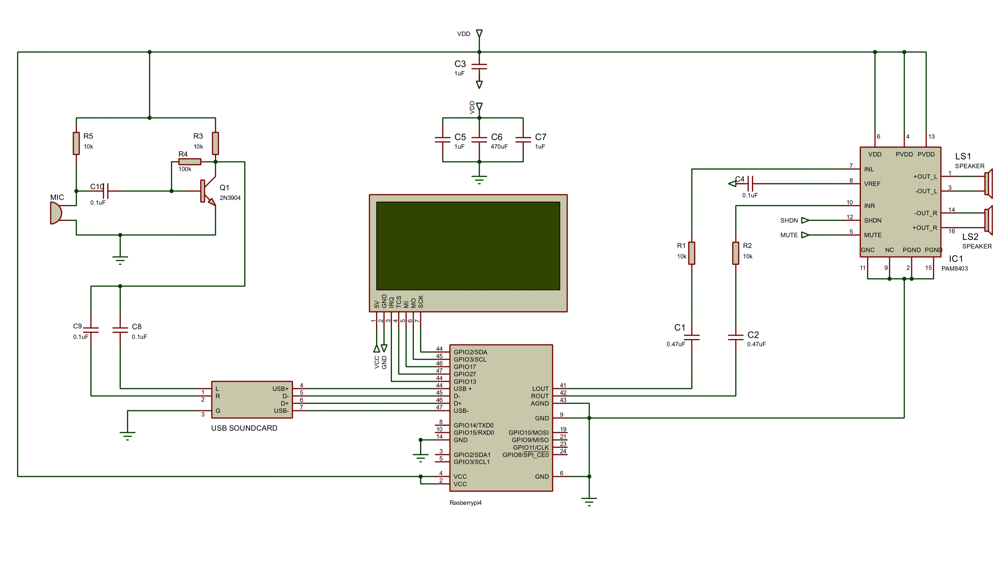
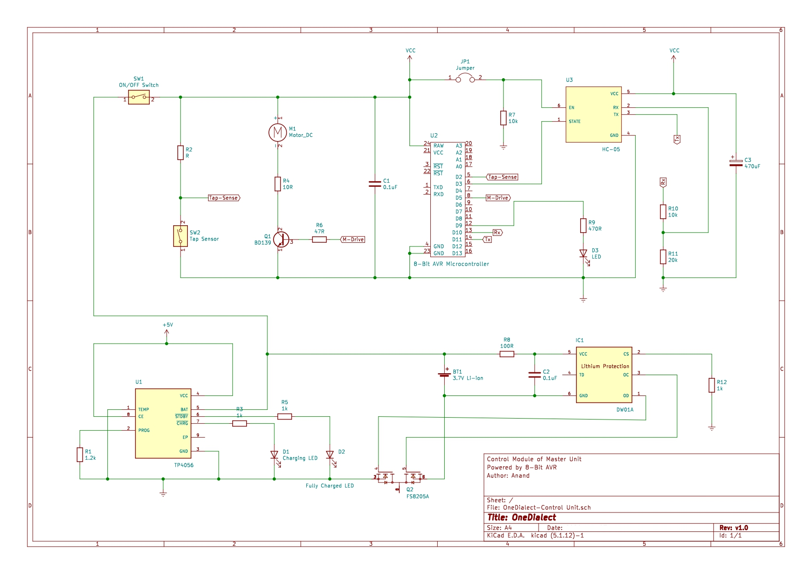
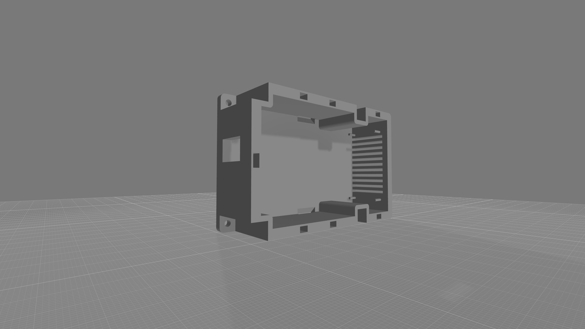
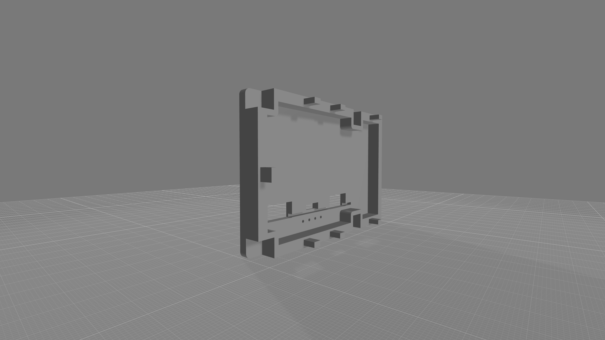

# OneDialect: A Unified Assistive Communication System

    

## Overview

**OneDialect** is a buildable assistive communication platform that translates between **speech, text, and tactile Morse output** using a combined Raspberry Pi and AVR architecture.

The system is intended for accessibility-oriented communication scenarios involving users with visual, auditory, or speech-related communication barriers, where information may need to move between spoken language, readable text, and tactile feedback without introducing dependency on disconnected assistive tools. The project is built around a practical engineering objective: create a communication system that can move reliably between speech, text, and touch without fragmenting the user experience across separate devices or disconnected workflows. Instead of isolating each mode of interaction, OneDialect brings them into a single hardware and software stack that can be studied, reproduced, and extended in a disciplined way.

This repository is structured for people who want to understand the system at the level of architecture, wiring, firmware behavior, and processing flow. The implementation is organized so the device can be examined as a real embedded build rather than as a high-level concept, while still remaining grounded in accessibility-focused system design.

---

## What This System Does

- Captures speech on the single-board computer side and converts it into usable text.
- Encodes text into Morse patterns for tactile communication.
- Accepts physical Morse-style input from the handheld unit through a button interface.
- Transfers data between units over Bluetooth.
- Delivers feedback through vibration and buzzer cues for real-time interaction.

---

## Design Philosophy

This is not a concept-only repository. The system is designed the way DIY hardware should be designed:

- **Modular** enough to understand and repair.
- **Practical** enough to prototype with accessible parts.
- **Deterministic** where timing matters.
- **Extendable** if you want to change the input method, output method, or processing stack.

The high-level processing is handled separately from the real-time interaction layer, which keeps the device easier to tune, debug, and evolve.

---

## System Architecture

### 1. Processing Layer

The Raspberry Pi handles the computation-heavy tasks:

- Speech capture
- Speech-to-text processing
- Text preparation
- Morse conversion logic

This layer is where you would continue expanding the project if you want to add better language support, different recognition models, logging, or richer accessibility workflows.

### 2. Interaction Layer

The AVR-based unit handles the time-sensitive side of the system:

- Button input detection
- Morse timing interpretation
- Haptic output control
- Audio cue generation
- Bluetooth I/O for device-to-device interaction

This split is one of the strengths of the project. The Pi does the thinking, and the AVR handles the physical conversation loop.

---

## Hardware Stack

| Component | Purpose |
| :--- | :--- |
| **Raspberry Pi 4** | High-level processing, speech handling, and conversion logic |
| **ATmega328P / AVR unit** | Real-time control, tactile feedback handling, and button input |
| **HC-05 Bluetooth module** | Wireless communication between the processing and interaction units |
| **Haptic motor** | Tactile message output |
| **Active buzzer** | Audible feedback and state indication |
| **Push button / switch input** | Morse-style user input |
| **Battery-powered supply stage** | Portable operation |

---

## Repository Layout

The repository is separated by function so the electronics, firmware, and processing logic can be followed without unnecessary overlap.

- [`src/avr`](src/avr) contains the AVR firmware for the handheld interaction unit.
- [`src/sbc`](src/sbc) contains the Raspberry Pi side Python scripts for speech recognition and Morse conversion.
- [`schematic`](schematic) contains the hardware references, including the latest master and slave unit schematics.
- [`assets`](assets) contains prototype images and assembled system views.

The application logic and firmware source are maintained under the `src` path.

---

## Code Breakdown

### AVR Firmware

The AVR firmware in `src/avr/AVR.ino` is responsible for:

- Sampling the SPDT-based input interface and resolving user interaction into dot, dash, and extended-hold control events
- Performing timing-window evaluation to segment continuous input into character, word, and message-level payload boundaries
- Serializing completed interaction payloads for Bluetooth-side transmission
- Orchestrating haptic and acoustic feedback paths in response to both local and remote state transitions
- Monitoring Bluetooth link state and reflecting connection-level events through device feedback behavior

At the firmware level, this layer functions as the interaction-state controller of the device. It is where low-level input timing, event interpretation, feedback sequencing, and transport-side signaling are consolidated into a deterministic execution path on the ATmega328P.

### SBC / Raspberry Pi Scripts

The Python scripts in `src/sbc` currently show the speech-processing side of the project:

- `voiceToText.py` handles live speech-to-text capture using Vosk and PyAudio
- `voiceToMorseCode.py` captures spoken input and converts the recognized text into Morse code symbols

These scripts are intentionally straightforward, which makes them easy to replace, improve, or integrate into a larger runtime.

---

## Hardware Implementation

OneDialect is built on a **master-slave architecture** that separates computation-heavy processing from deterministic interaction control. This partitioning is fundamental to the reliability of the system.

The **master unit** is centered on the Raspberry Pi and serves as the high-level processing domain. It handles the software-defined parts of the system, including speech capture, recognition, text preparation, and the generation of communication payloads that can be transferred to the interaction layer.

The **slave unit** is centered on the ATmega328P and serves as the real-time interaction domain. This is where user input is sampled, timed events are interpreted, output signals are driven, and the tactile communication cycle is maintained with microcontroller-level predictability.

This architecture is not just a structural convenience. It allows the system to assign each class of work to the platform most suited for it. The Raspberry Pi carries the variable and compute-intensive portions of the pipeline, while the ATmega328P enforces precise response behavior on the physical side of the device. The result is a system that remains easier to scale in software without compromising interaction timing at the hardware level.

### Master Unit Schematic

The master unit schematic represents the processing and coordination layer of the device. Its primary role is to acquire communication input, execute the software-side transformation pipeline, and maintain the communication path to the handheld interaction unit. In this design, the Raspberry Pi is not treated merely as a controller board; it is the computational backbone that hosts the speech-processing runtime and the conversion logic required to bridge spoken language, textual representation, and Morse-compatible output.

Within this section of the system, audio or text data enters the high-level processing path and is interpreted in software before being converted into a transportable payload. That payload is then passed outward through the Bluetooth link to the slave unit, where it becomes actionable feedback. The schematic should therefore be read as the control-side domain of the project: a domain where computation, protocol handling, and message preparation are consolidated into a single node with enough processing headroom to support future expansion.

An important architectural decision is visible in that role separation. The master side does not directly assume responsibility for tactile timing, button event segmentation, or output pulse generation. Those responsibilities remain outside the Pi and are deliberately offloaded to the embedded controller. This keeps the processing layer extensible while preventing operating-system-level variability from leaking into the physical interaction loop.

### Slave Unit Schematic

The slave unit schematic represents the embedded interaction layer and is where the design makes full use of the **ATmega328P** as a dedicated real-time control device. This is the portion of the system responsible for translating user intent into timed input events and converting incoming message data into tactile and audible output patterns with controlled timing behavior.

At the center of this circuit, the ATmega328P coordinates several concurrent responsibilities. It monitors the button interface and classifies press duration into Morse-relevant events such as dots, dashes, and extended control holds. It tracks the temporal spacing between events so that character boundaries, word boundaries, and completed message segments can be inferred without requiring a complex front-end input device. At the same time, it manages the output side of the interaction layer by driving the haptic motor and buzzer in response to local state changes or incoming Bluetooth commands.

The importance of the ATmega328P in this design is not only that it provides I/O control, but that it allows the interaction model to be enforced at the firmware level. Timing thresholds, event grouping, feedback sequencing, and Bluetooth message exchange all operate within a tightly controlled microcontroller environment. That gives the handheld unit a level of deterministic behavior that would be significantly harder to guarantee if these functions were left entirely to the higher-level processing platform.

The Bluetooth module forms the bridge between the slave unit and the master unit, carrying outbound Morse-derived payloads and inbound output commands. Around that communication path, the remainder of the circuit is organized to support physical usability: the button interface for input capture, the haptic stage for tactile rendering, the buzzer for confirmation and status signaling, and the supply path for standalone operation. Taken together, the slave unit is not a passive endpoint. It is an embedded interpretation engine built around the ATmega328P, and it is this layer that gives the system its responsive, device-grade interaction behavior.

### Practical Source Mapping

The implementation in the repository follows the same hardware split:

- `src/avr/AVR.ino` maps to the behavior of the slave unit shown in the schematic.
- `src/sbc/voiceToText.py` and `src/sbc/voiceToMorseCode.py` map to the speech and conversion flow on the master unit.
- `schematic/master_unit_v2.jpg` and `schematic/slave_unit_v2.png` document the current hardware reference set.

---

## Implementation Flow

The implementation reflected in this repository follows the same architectural order as the hardware itself. The schematics define the electrical split between the processing side and the interaction side, the firmware in `src/avr/AVR.ino` defines the behavior of the ATmega328P-driven slave unit, and the scripts in `src/sbc` define the speech and conversion pipeline hosted on the Raspberry Pi. This alignment between documentation, hardware partitioning, and source layout is intentional, because it makes the system readable as an integrated engineering build rather than as a collection of isolated files.

---

## 3D Model Views

This enclosure model captures the lower structural section of the device housing and reflects the mechanical planning behind the hardware package.

The upper enclosure section completes the physical packaging strategy of the system.

---

## System Visuals

The assembled system view shows the relationship between the processing side and the user interaction side in deployed form.

This view highlights the physical construction of the master-side enclosure and internal placement approach used during integration.

### Development Stage

The development prototype captures the system in its more open engineering state, where wiring, module positioning, and iteration are easier to inspect and modify.

---

## Why This Project Matters

Assistive hardware is often presented either as research, as a closed product, or as something too specialized for independent builders and engineers to approach. OneDialect takes the opposite route.

This project is built to be understandable at the implementation level. The electronics are approachable, the processing stack is separated cleanly from the interaction layer, and the firmware behavior is direct enough to inspect and tune. More importantly, it is an accessibility-focused system rather than as a purely technical exercise, with each architectural decision tied back to practical communication support across speech, text, and tactile interaction. If your interest is in embedded systems, accessibility hardware, human-device interaction, or reproducible assistive design, this repository is intended to be useful both as a working reference and as a foundation for further development.

---

## Project Contributors
The system was designed and implemented by a cross-functional engineering team:

- **Ameer T S**
    - **Designation**: Power Electronics Developer
    - **Bio**: Electrical Engineer with hands-on experience in industrial and high-voltage systems. Skilled in PLC/SCADA, protective relays, transformers, and switchgear, with a strong focus on system reliability, preventive maintenance, and efficient operations.
    - **Links**: [LinkedIn](https://www.linkedin.com/in/ameerts) | [GitHub](https://github.com/ameeribnushajahan)

- **Anagha S**
    - **Designation**: Software Developer
    - **Bio**: Software developer with a strong focus on machine learning and video analytics. Combines analytical thinking with an artistic approach to build efficient and impactful solutions. Focused on clean architecture, problem-solving, and continuous technical growth.
    - **Links**: [LinkedIn](https://www.linkedin.com/in/anagha-s-menon-here) | [GitHub](https://github.com/ANAGHA-20)

- **Muhammed Sahal M H**
    - **Designation**: Hardware Developer
    - **Bio**: Electrical Engineer with maintenance experience across the manufacturing industry, along with experience in control panel assembly, diagnostics, and substation operations. Proven ability to resolve faults, and ensure reliable electrical system performance.
    - **Links**: [LinkedIn](https://www.linkedin.com/in/muhammed-sahal-m-h-391256194) | [GitHub](https://github.com/muhammed-sahal-m-h)

- **Ananya Ajith Kallungal**
    - **Designation**: ML Developer
    - **Bio**: Engineer skilled in machine learning, Python, and data-driven systems, with a background in electrical engineering. Focused on building scalable, efficient solutions while applying analytical models and system-level thinking to solve complex problems.
    - **Links**: [LinkedIn](https://www.linkedin.com/in/ananya-ajith-kallungal) | [GitHub](https://github.com/ananya-ajith-kallungal)

- **Anand P S**
    - **Designation**: Firmware Systems Developer
    - **Bio**: Engineer specializing in distributed backend architectures, embedded systems, firmware development, and production-grade software design. Builds efficient, fault-tolerant systems with a focus on scalability and long-term maintainability.
    - **Links**: [LinkedIn](https://www.linkedin.com/in/anand-ps) | [GitHub](https://github.com/anand-ps)

- **Sidharth S**
    - **Designation**: Software Developer
    - **Bio**: Software developer specializing in distributed systems and scalable backend architecture. Experienced in building high-performance applications using React, TypeScript, Node.js, and Go, with expertise in databases like Aerospike and ArangoDB. Focused on performance optimization, system reliability, and designing robust, production-grade solutions.
    - **Links**: [LinkedIn](https://www.linkedin.com/in/sidharthism/) | [GitHub](https://github.com/sidharthism)

---
© 2026 Anand P S. All rights reserved.
